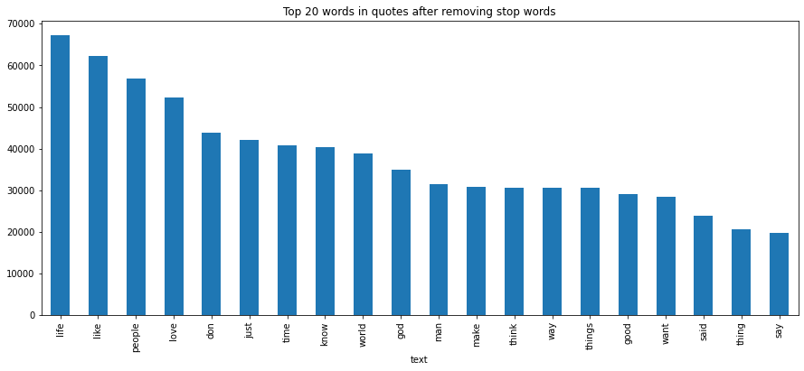
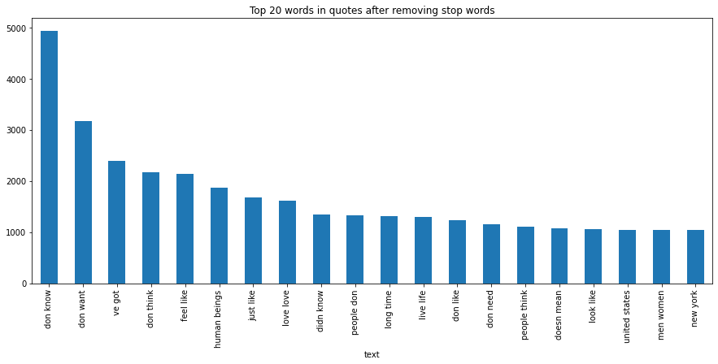
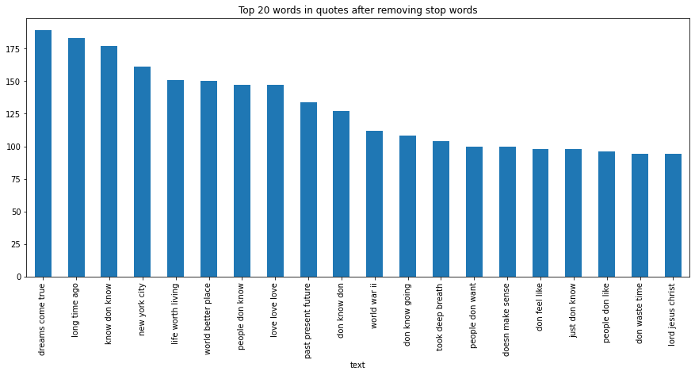

# **Quote Classification**

### **The project is about determining whether a test string is a motivational quote or not through natural language processing.**

# Table of Contents
1. [Introduction](#Introduction)
2. [Graph](#Graph)
3. [Usage](#Usage) 
4. [Note](#Note)

## Introduction
**Motivated people feel better!**
Keeping this purpose in mind, quote classification is a Python based project that allows any string to be classified as motivational or not.

In this project, around 1M data strings containing both quotes and reviews or blogs as non-quotes are cleaned, processed further, and then POS (Part of Speech) are generated to create feature vectors. Following the initial feature vectors, various classifiers are trained, and the predictions are assembled together.  
***
## Graph
### we can understand our data in the following graph where we can look at 20 most frequent word in dataset in different scenario.

***
## Usage
-  import ensemble.py and featureextaction.py file to get prediction, follow example below
> ensemble_clf = ensemble.EnsembleClassifier(ONB_Clf, MNB_Clf, BNB_Clf, LogReg_Clf, SGD_Clf,SVC_clf)

> feature_list = [f[0] for f in self.testing_set]
ensemble_preds = [ensemble_clf.classify(features) for features in feature_list]
return ensemble_preds

***
## Note
***Models are trained on 10% of actual data.*** 